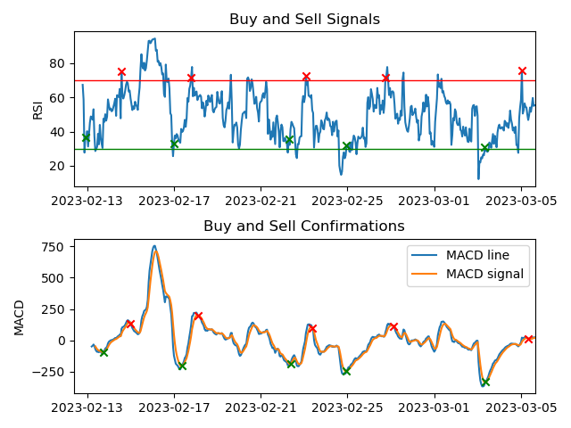

# RSI_MACD_strategy
Python script for crypto trading analysis using RSI and MACD indicators. It's a personal study script for education purposes **ONLY**.

## Objective
Create a python script using Binance API and Pandas TA that can indicate buy and sell operations aiming profit in the crypto market. Utilizing Relative Strength Index (RSI) and Moving Average Convergence/Divergence (MACD), both technical indicators in the financial market.

## Strategy
The strategy of this script was based on article [How to Use RSI and MACD Indicators to Have Profitable Crypto Trades](https://medium.com/coinmonks/4-step-profitable-trades-using-rsi-and-macd-indicators-a0fca6400fd2) (Ehsan Yazdanparast, 2021). 

It's composed by two technical indicators and has 4 steps to complete an operation. Steps for an operation:
1. Buy signal (RSI);
2. Buy confirmation (MACD);
3. Sell signal (RSI);
4. Sell confirmation (MACD).

After one complete operation, it's possible to evaluate the profit.

In the article the data was evaluated every 4 hours, so, the time frame was 4 hours. But it's totally possible to try different setups for the strategy, for example, I've used the 1 hour time frame.
The possible time frames can be consulted [here](https://python-binance.readthedocs.io/en/latest/binance.html?highlight=4hour#binance.client.BaseClient.KLINE_INTERVAL_12HOUR).

As this is an analysis based on past data, it's necessary to indicate the whole time frame of the analysis.
### RSI
RSI will be used for buy and sell signals (that have to be approved by MACD).
#### Indicator settings
- Length: 10;
- Source: Closed values.
#### Buy Signal
RSI line must to goes below 30 and after touches back the line of 30 again, so a buy signal is flagged.
#### Sell Signal
If the RSI line goes above 70, a sell signal is flagged.
### MACD
MACD will be used for buy and sell confirmations.
#### Indicator settings
- Fast Length: 8;
- Slow Length: 21;
- Signal Smoothing: 5;
- Source: Closed values;
- Oscillator MA Type: EMA;
- Signal Line MA Type: EMA.

#### Buy Confirmation
After a buy signal, if "MACD line" goes over the "Signal line" a buy confirmation is flagged.

#### Sell Confirmation
After a buy signal, if "MACD line" goes below the "Signal line" a buy confirmation is flagged.

## Script
Will be disposed three scripts (main.py, keys.py and time_set.py). The first one is the software that will perform the connection with Binance, obtain the data, do the analysis, etc. The second one, it's a template for your Binance API keys, that the "main.py" utilizes for doing the connection. The third one, it's a script that I used to set the time of my laptop equal to the Binance server time, just if you need.

### Connection with the Binance account
It's necessary to create an API from your Binance Account and then replace your API key and secret key in the file "keys.py". When you run the main.py script, it will use these keys to connect into your Binance account.

### Selection of the currency symbol
Select the symbol of a currency that you have interest in.

### Obtaining the data from candlesticks
If you run the script, the data will be obtained automatically. If you would like to use a different source of data, it's possible.

### RSI and MACD calculations
The indicators will be obtained with the Pandas TA library.

### Buy and sell analysis
Will be performed the previously mentioned strategy.

### Plots and output
Will be showed a simulation of the strategy with an initial value that you can change. A RSI and MACD plot, with the points of interest, will be showed.

### Libraries
- Binance API;
- Pandas;
- Pandas TA;
- Matplotlib;
- NumPy.

## Results
Here is a run done in 05 mars 2023 17h24 (GMT +01). I used "1HOUR" as the time frame, "512 hours ago" as the whole time frame and "BTCUSDT" as the currency symbol.
### RSI and MACD plots

Each "x" are signals or confirmations points. The greens for buy and the reds for sell.

### Output
---------- Operations Records ----------

BUY  -  2023-02-12 22:00:00  -  BTC: $21794.52

SELL -  2023-02-14 14:00:00  -  BTC: $22247.39

BUY  -  2023-02-17 00:00:00  -  BTC: $23713.37

SELL -  2023-02-17 19:00:00  -  BTC: $24524.49

BUY  -  2023-02-22 07:00:00  -  BTC: $24060.95

SELL -  2023-02-23 02:00:00  -  BTC: $24531.61

BUY  -  2023-02-24 23:00:00  -  BTC: $23185.29

SELL -  2023-02-26 18:00:00  -  BTC: $23486.43

BUY  -  2023-03-03 08:00:00  -  BTC: $22430.33

SELL -  2023-03-05 01:00:00  -  BTC: $22591.68

---------- Results ----------

Initial Wallet: $500.00

Post-operations Wallet: $542.30

Profit: $42.30

Percentage of profit: 8.46%

## References
- https://medium.com/coinmonks/4-step-profitable-trades-using-rsi-and-macd-indicators-a0fca6400fd2
- https://python-binance.readthedocs.io/en/latest/overview.html
